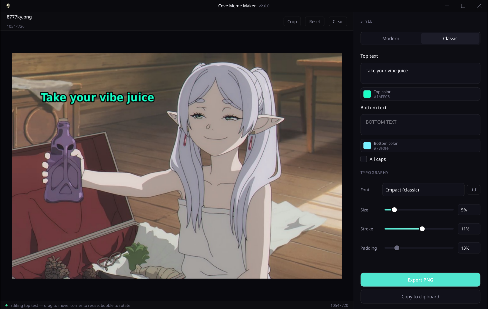

# Cove Meme Maker

A focused, offline meme generator for **Linux** and **Windows**. No cloud,
no template library, no account — drop in your own image, type some text,
and export.



## Download (v2.0.0)

| Platform | File |
| -------- | ---- |
| Windows (installer) | `cove-meme-maker-2.0.0-Setup.exe` |
| Windows (portable) | `cove-meme-maker-2.0.0-Portable.exe` |
| Linux (AppImage) | `Cove-Meme-Maker-2.0.0-x86_64.AppImage` |
| Linux (Debian / Ubuntu) | `cove-meme-maker_2.0.0_amd64.deb` |

Grab the artifacts from the [Releases page](https://github.com/Sin213/cove-meme-maker/releases).

## Styles

- **Classic** — white top/bottom text with a black outline, Impact-style,
  burned inside the image. Text can be **dragged**, **resized**, and
  **rotated** directly on the preview.
- **Modern** — a black caption on a white band above the image, the
  "Tumblr-style" meme.

## Features

- **Drag-and-drop or click** the preview pane to load a file.
- **Live preview** — every text or settings change re-renders on the spot.
- **Direct text manipulation** — click a classic text block to select it,
  then drag to move, pull a corner handle to resize, or grab the rotation
  bubble to rotate. All changes are reflected in real time.
- **Crop tool** — open the crop dialog to trim your image before adding
  text. Drag the region or pull edge/corner handles; a rule-of-thirds guide
  helps with composition.
- **Per-line colour pickers** for the top, bottom, and caption text.
- **ALL CAPS toggle** — on by default for Classic (keeps the Impact feel),
  off if you want to respect the case you typed.
- **Font picker** with sensible system fallbacks; **Load .ttf…** to supply
  your own (e.g. bring your own Impact on Linux).
- **Size / stroke / padding sliders** as a percentage of image height —
  renders look the same across resolutions.
- **Copy to clipboard** — paste the rendered meme straight into a chat app,
  no file save required.
- **Cove dark theme** — deep, teal-accented dark UI matching the Cove
  design system (Cove Nexus, Cove GIF Maker). Custom frameless window
  chrome with Windows-style minimize / maximize / close controls.
- **Remembers your settings** — style, font, sizes, colours, and all-caps
  persist between sessions via QSettings.
- **Auto-updater** — checks GitHub Releases for new versions on launch.

## Formats

| Input | Output |
| ----- | ------ |
| `.png` `.jpg` `.jpeg` `.webp` `.bmp` | PNG, JPG, WebP |

## Requirements

- Python 3.10+
- `PySide6` and `Pillow` (installed automatically by `pip`)

## Running from source

```bash
python -m venv .venv
source .venv/bin/activate   # Linux / macOS
# .venv\Scripts\activate    # Windows
pip install -e .
cove-meme-maker
```

Or without installing:

```bash
PYTHONPATH=src python -m cove_meme_maker
```

## Building release artifacts

### Linux (AppImage + .deb)

```bash
VERSION=2.0.0 ./scripts/build-release.sh
```

Produces `Cove-Meme-Maker-<version>-x86_64.AppImage` and
`cove-meme-maker_<version>_amd64.deb` under `release/`.

### Windows (Setup.exe + Portable.exe)

```powershell
.\build.ps1 -Version 2.0.0
```

Requires Python 3.12+ and [Inno Setup 6](https://jrsoftware.org/isdl.php).
Produces `cove-meme-maker-<version>-Setup.exe` and
`cove-meme-maker-<version>-Portable.exe` under `release\`.

### GitHub Actions

Tagging a commit `vX.Y.Z` triggers `.github/workflows/release.yml`, which
produces all four artifacts and attaches them to a GitHub release.

## Fonts

Impact ships with Windows, so Classic memes look right there out of the
box. The Windows builds bundle DejaVu Sans Bold as a guaranteed fallback.
On Linux the app falls back to DejaVu Sans Condensed Bold / Liberation
Sans Bold — install the `ttf-ms-fonts` / `msttcorefonts` package for the
authentic look, or use **Load .ttf…** in the font picker to supply your
own.

## License

MIT — see [LICENSE](LICENSE).
