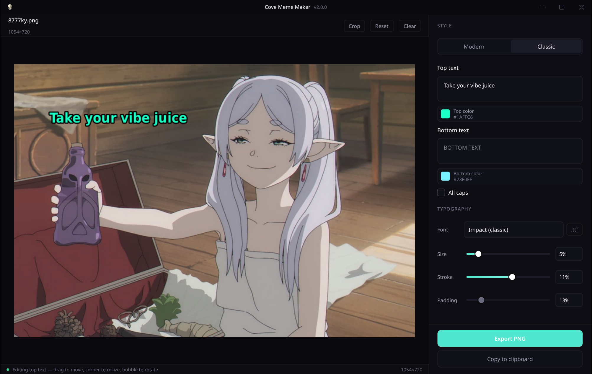

# Cove Meme Maker

A focused, offline meme generator for **Linux**, **Windows** and **macOS**
(Apple Silicon, experimental). No cloud, no template library, no account.
Drop in your own image, type some text, and export.



## Download (v2.4.0)

| Platform | File |
| -------- | ---- |
| Windows (installer) | `cove-meme-maker-2.4.0-Setup.exe` |
| Windows (portable) | `cove-meme-maker-2.4.0-Portable.exe` |
| Linux (AppImage) | `Cove-Meme-Maker-2.4.0-x86_64.AppImage` |
| Linux (Debian / Ubuntu) | `cove-meme-maker_2.4.0_amd64.deb` |
| macOS 12+ (Apple Silicon, experimental) | `Cove-Meme-Maker-2.4.0-macOS-arm64.zip` |
| macOS 12+ (Apple Silicon, experimental, disk image) | `Cove-Meme-Maker-2.4.0-macOS-arm64.dmg` |

Every artifact ships with a matching `.sha256` sidecar. Grab the artifacts
from the [Releases page](https://github.com/Sin213/cove-meme-maker/releases).

The macOS build is **experimental**: Apple Silicon only (no Intel, no
universal2), ad-hoc signed and not notarized, so Gatekeeper blocks it on
first launch. Right-click the app and choose **Open**, or allow it under
**System Settings > Privacy & Security**. macOS updates are not installed
automatically; the app opens the release page instead.

## Styles

- **Classic**: white top/bottom text with a black outline, Impact-style,
  burned inside the image. Text can be **dragged**, **resized**, and
  **rotated** directly on the preview.
- **Modern**: a black caption on a white band above the image, the
  "Tumblr-style" meme.

## Features

- **Drag-and-drop or click** the preview pane to load a file.
- **Live preview**: every text or settings change re-renders on the spot.
- **Direct text manipulation**: click a classic text block to select it,
  then drag to move, pull a corner handle to resize, or grab the rotation
  bubble to rotate. All changes are reflected in real time.
- **Multi-image overlays**: drop several images onto a meme and position
  each one independently. Drag from the canvas or the dedicated top move
  anchor, pull a handle to resize, and use the top handle to rotate.
  Overlays render through the same Pillow path as the export, so the
  preview matches the saved file.
- **Crop tool**: open the crop dialog to trim your image before adding
  text. Drag the region or pull edge/corner handles; a rule-of-thirds guide
  helps with composition.
- **Per-line colour pickers** for the top, bottom, and caption text.
- **ALL CAPS toggle**: on by default for Classic (keeps the Impact feel),
  off if you want to respect the case you typed.
- **Font picker** with sensible system fallbacks; **Load .ttf...** to supply
  your own (e.g. bring your own Impact on Linux).
- **Size / stroke / padding sliders** as a percentage of image height, so
  renders look the same across resolutions.
- **Copy to clipboard**: paste the rendered meme straight into a chat app,
  no file save required.
- **Cove dark theme**: deep, teal-accented dark UI matching the Cove
  design system (Cove Nexus, Cove GIF Maker). Custom frameless window
  chrome with Windows-style minimize / maximize / close controls.
- **Remembers your settings**: style, font, sizes, colours, and all-caps
  persist between sessions via QSettings.
- **Auto-updater**: checks GitHub Releases for new versions on launch.
  Linux AppImage installs swap themselves in place; Windows, `.deb` and
  macOS open the release page for a manual download.

## Cove Nexus (foxy mode)

Cove Meme Maker also ships an embedded web UI that runs inside Cove Nexus.
When launched in foxy mode the app skips Qt entirely and serves a browser
tab that talks to the same Pillow rendering engine as the desktop build, so
a meme built in Nexus exports pixel for pixel identical to one built in the
desktop app.

- **Classic and Modern styles** with the same top / bottom / caption text
  fields, per-line colour pickers, ALL CAPS toggle, font picker, and
  size / stroke / padding sliders as the desktop app.
- **Live text overlays**: top, bottom and caption text draw directly on the
  canvas as you type, including the Modern white caption band, so there is
  no round trip to the server for simple edits.
- **Image overlays** (new in 2.4.0): the **Add Image** button drops up to 8
  overlays onto a meme. Each one is draggable, resizable and rotatable on
  the canvas, with bring-forward / send-back z-order controls and per-overlay
  delete.
- **Crop / Frame**: **Enable crop** trims the image before text is applied,
  and overlay positions follow the crop region, so what you arrange while
  cropping is what the export shows.
- **Export PNG** and **Copy to clipboard** both run a full server-side
  render through the shared `OverlaySpec` path.
- **Hardened render endpoint**: request bodies, decoded image bytes and
  pixel counts are capped (10 MB / 16 MP per source image, 5 MB / 16 MP per
  overlay), base64 input is validated, and a token-bucket rate limiter
  guards `/render`. Tune it with `COVE_NEXUS_RENDER_RATE_CAPACITY` and
  `COVE_NEXUS_RENDER_RATE_REFILL`.

## Formats

| Input | Output |
| ----- | ------ |
| `.png` `.jpg` `.jpeg` `.webp` `.bmp` | PNG, JPG, WebP |

## Requirements

- Python 3.10+
- `PySide6` and `Pillow` (installed automatically by `pip`)

## Running from source

```bash
python -m venv .venv
source .venv/bin/activate   # Linux / macOS
# .venv\Scripts\activate    # Windows
pip install -e .
cove-meme-maker
```

Or without installing:

```bash
PYTHONPATH=src python -m cove_meme_maker
```

## Building release artifacts

### Linux (AppImage + .deb)

```bash
VERSION=2.4.0 ./scripts/build-release.sh
```

Produces `Cove-Meme-Maker-<version>-x86_64.AppImage` and
`cove-meme-maker_<version>_amd64.deb` under `release/`.

### Windows (Setup.exe + Portable.exe)

```powershell
.\build.ps1 -Version 2.4.0
```

Requires Python 3.12+ and [Inno Setup 6](https://jrsoftware.org/isdl.php).
Produces `cove-meme-maker-<version>-Setup.exe` and
`cove-meme-maker-<version>-Portable.exe` under `release\`.

### macOS (ZIP + DMG, Apple Silicon)

```bash
./scripts/build-macos.sh
```

Must be run on an arm64 Mac. The version comes from
`src/cove_meme_maker/__init__.py` unless `VERSION` is set. Produces
`Cove-Meme-Maker-<version>-macOS-arm64.zip` and
`Cove-Meme-Maker-<version>-macOS-arm64.dmg` under `release/`.

### GitHub Actions

Tagging a commit `vX.Y.Z` triggers `.github/workflows/release.yml`, which
builds all six artifacts on Linux, Windows and macOS runners, launch-tests
each package, generates a `.sha256` sidecar per binary, and attaches
everything to a GitHub release using
`.github/RELEASE_NOTES_v<version>.md` as the release body.

## Fonts

Impact ships with Windows, so Classic memes look right there out of the
box. The Windows builds bundle DejaVu Sans Bold as a guaranteed fallback.
On Linux the app falls back to DejaVu Sans Condensed Bold / Liberation
Sans Bold. Install the `ttf-ms-fonts` / `msttcorefonts` package for the
authentic look, or use **Load .ttf...** in the font picker to supply your
own.

## License

MIT, see [LICENSE](LICENSE).
